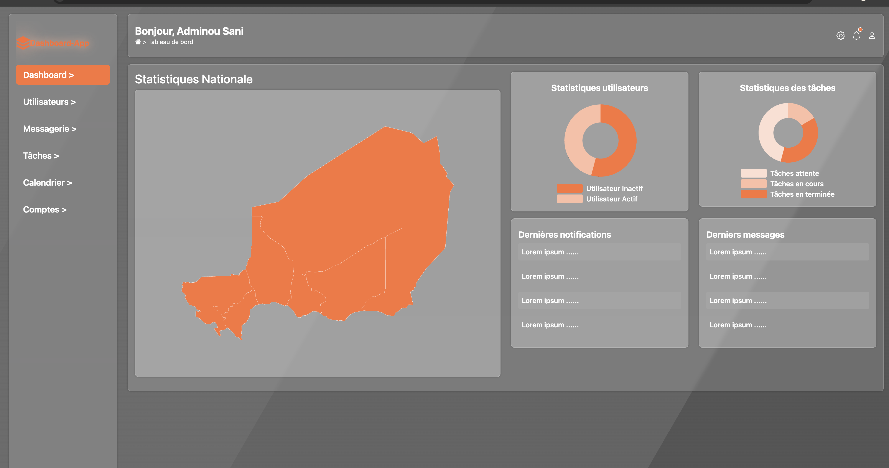
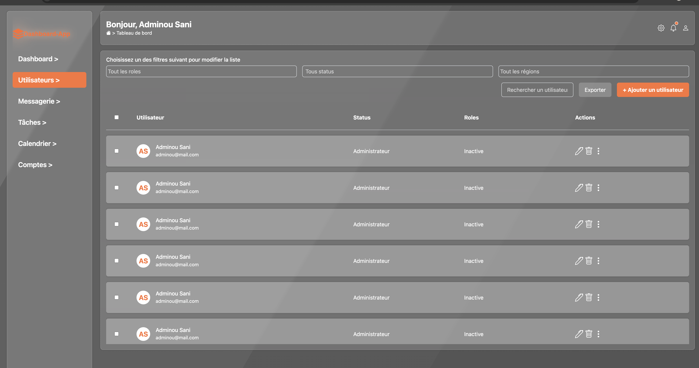
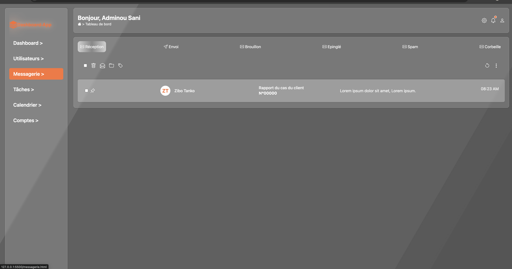
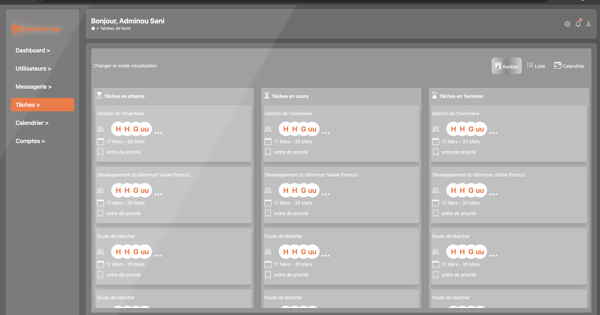
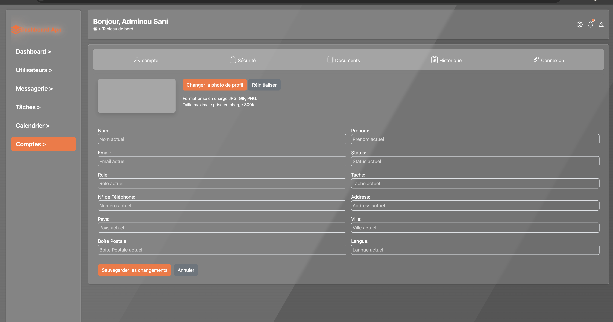

# Dashboard-App

Un tableau de bord (dashboard) moderne et responsive développé dans le cadre d'un projet scolaire.

## Description

Dashboard-App est une application web de gestion qui permet de visualiser et gérer différentes données à travers une interface intuitive. Elle comprend plusieurs modules : messagerie, gestion des utilisateurs, tâches, calendrier et comptes.

## Fonctionnalités

* Messagerie — Réception, envoi, brouillons, épinglés, spam et corbeille
* Utilisateurs — Gestion et consultation des utilisateurs
* Tâches — Visualisation en mode Kanban, Liste et Calendrier
* Calendrier — Suivi des événements
* Comptes — Gestion des profils utilisateurs
* Responsive — Compatible mobile, tablette et desktop

## Technologies utilisées

## Technologies utilisées

* **HTML5** – structure des pages
* **CSS3** – personnalisation du design
* **Bootstrap 5** – mise en page responsive 
* **Google Fonts** – typographie du site
* **Bootstrap Icons** -Icônes de l'interface

## Structure du projet

**Dashboard-App/**
│
├── index.html          # Page principale
├── accueil.html        # Tableau de bord
├── utilisateur.html    # Gestion des utilisateurs
├── messagerie.html     # Module messagerie
├── taches.html         # Module tâches (Kanban)
├── calendrier.html     # Module calendrier
├── comptes.html        # Gestion des comptes
│
├── style.css           # Feuille de style principale
│
└── Logo (1).png        # Logo du projet

## Installation et utilisation

### Prérequis

Un navigateur web moderne (Chrome, Firefox, Edge, Safari)
Aucune installation requise

## Design

* Fond animé avec dégradé dynamique
* Effet glassmorphism (verre dépoli) sur les composants
* Couleur principale : Orange #FF7339
* Sidebar fixe sur desktop, offcanvas sur mobile
* Scroll horizontal et vertical sur les tableaux et kanban

